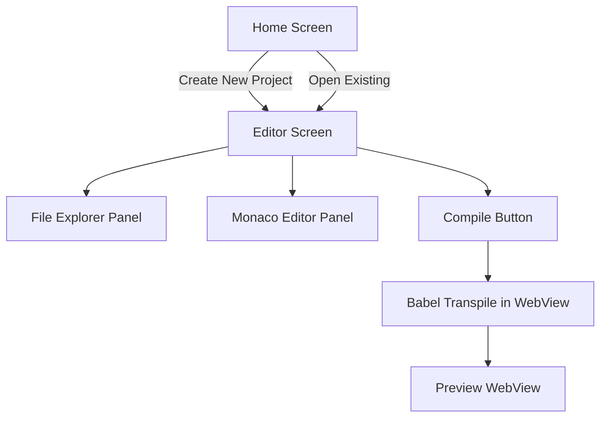

# React Native Code Editor App

A mobile code editor for practicing React, similar to CodeSandbox. Users can create new React projects with a boilerplate template, edit code on-device, compile via Babel, and view the live preview — all within a single app.

## Tech Stack Decisions

| Concern | Choice | Reason |
|---|---|---|
| Framework | **Expo (React Native)** | Easiest cross-platform setup, good WebView & AsyncStorage support |
| Code Editor | **Monaco Editor via WebView** | Industry-standard editor with full JSX syntax highlighting |
| Transpilation | **@babel/standalone in WebView** | Runs Babel in-browser inside a WebView so no native build needed |
| Preview | **React Native WebView** | Renders compiled React output in an isolated HTML page |
| Persistence | **AsyncStorage** | Store project files locally on device |
| Navigation | **React Navigation (Stack)** | Home → Editor navigation |
| UI Theme | **Dark, code-editor-inspired** | VS Code-style dark theme |

## Architecture Overview



## Proposed Changes

### Project Root

#### [NEW] package.json + Expo config
- `package.json` with Expo dependencies
- `app.json` for Expo configuration
- `babel.config.js`

---

### App Entry & Navigation

#### [NEW] App.js
- Root component with React Navigation stack
- `HomeScreen` and `EditorScreen` routes

---

### Screens

#### [NEW] src/screens/HomeScreen.js
- Welcome UI with app branding
- "New Project" button → navigates to EditorScreen with fresh template
- List of recent projects (from AsyncStorage)
- "Open" button per project

#### [NEW] src/screens/EditorScreen.js
- Split-layout: File Explorer (left/drawer) + Editor (main) + Preview (bottom/right)
- Toolbar with: Run ▶ button, file tabs, project name
- Integrates `MonacoEditorWebView` and `PreviewWebView`

---

### Components

#### [NEW] src/components/MonacoEditorWebView.js
- Renders Monaco Editor inside a `<WebView>` using a self-contained HTML string
- Props: `value`, `onChange`, `language` (`javascript` / `jsx`)
- Postmessages to communicate editor changes back to React Native

#### [NEW] src/components/PreviewWebView.js
- Receives compiled JS code as a string
- Renders it in an isolated HTML page that includes React + ReactDOM via CDN
- Shows error overlay if compilation fails

#### [NEW] src/components/FileExplorer.js
- Displays project files (App.js, index.js, styles.js)
- Highlight active file, tap to switch

---

### Utilities

#### [NEW] src/utils/compiler.js
- `compileCode(sourceCode)` — wraps calls to Babel via the preview WebView
- `getDefaultTemplate()` — returns boilerplate React project files

#### [NEW] src/utils/storage.js
- `saveProject(project)` — persist via AsyncStorage
- `loadProjects()` — retrieve all saved projects
- `deleteProject(id)` — remove a project

#### [NEW] src/templates/reactTemplate.js
- Default React project template:
  - `App.js` with a simple counter component
  - `index.js` entry point
  - `styles.js` stylesheet

---

## Verification Plan

### Automated Tests
No existing test suite. Manual verification is used for this project.

### Manual Verification (step-by-step)

1. **Start the app**
   ```
   cd c:\Users\Administrator\Downloads\react-code-editor
   npx expo start
   ```
   Scan QR code with Expo Go app, OR press `w` for web.

2. **Home Screen**
   - Verify the welcome screen loads with "Create New Project" button
   - Tap "Create New Project" → should navigate to editor

3. **Editor Screen — code editing**
   - Verify Monaco editor loads with default `App.js` template code
   - Type some code — verify editor responds and updates the file content

4. **Compilation & Preview**
   - Click the ▶ "Run" button
   - Verify preview panel shows the rendered React output (e.g. counter button)

5. **Error Handling**
   - Introduce a syntax error in the editor (e.g. remove a closing bracket)
   - Click Run → verify error message displays in the preview area

6. **Project Persistence**
   - Create a project, edit code, navigate back to Home
   - Verify project appears in the recent projects list
   - Tap "Open" → verify code is restored correctly
